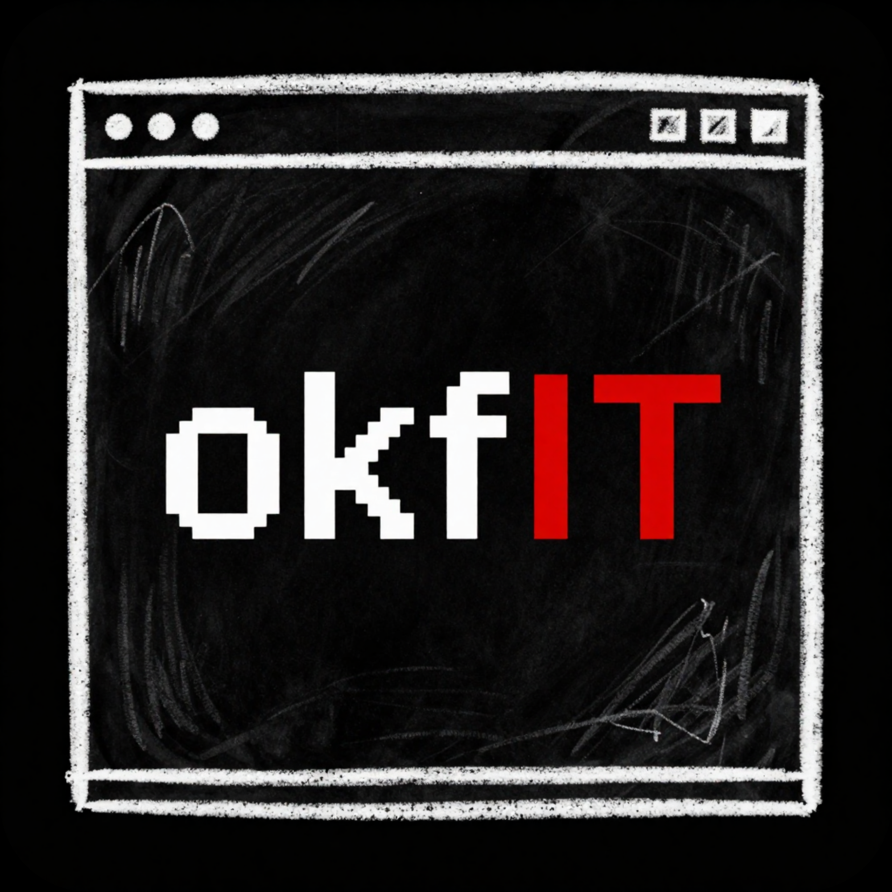

<div align="center">
  

  <p><strong>Open Knowledge Format for AI agents.</strong></p>

  <p>Turn docs into agent-readable knowledge bundles.</p>

  <p>
    OKF bundles | MCP server | local-first | no LLM key | Git-diffable context
  </p>

  <p>
    <a href="https://www.npmjs.com/package/okfit"></a>
    <a href="https://github.com/okfIT/okfIT/actions/workflows/ci.yml"></a>
    <a href="https://github.com/okfIT/okfIT/blob/main/LICENSE"></a>
    
    
  </p>

  <p>
    <a href="#use-with-agents">Use with agents</a> |
    <a href="#official-agent-skill">Agent skill</a> |
    <a href="#activation-packet">Activation packet</a> |
    <a href="#preview-the-inspector">Preview Inspector</a> |
    <a href="#local-okfit-hub">Local Hub</a> |
    <a href="#project-stack-workspaces">Project stack workspaces</a> |
    <a href="#keep-sources-fresh">Keep sources fresh</a> |
    <a href="#create-a-bundle">Create a bundle</a> |
    <a href="#optional-cli-install">CLI install</a> |
    <a href="#why-okf">Why OKF</a> |
    <a href="docs/mcp-clients.md">More clients</a>
  </p>
</div>

---

Agents are bad at reading docs when the only options are "paste everything" or "trust a hidden vector index".

`okfit` converts documentation websites and local Markdown folders into [Open Knowledge Format](https://github.com/GoogleCloudPlatform/knowledge-catalog/tree/main/okf) v0.1-conformant bundles: typed Markdown concept files with frontmatter, reserved navigation files, source URLs, internal links, backlinks, and a read-only MCP server. It can also remember third-party docs sources locally and refresh their bundles when they go stale.

Use it when you want Claude, Codex, Cursor, or another MCP-capable agent to search one docs source or a whole project stack, read only the relevant pages, traverse neighbors, and cite sources without dumping docs sites into context.


## Use With Agents

okfit is meant to sit behind your coding agent as a local MCP server. Run setup once for a docs source, then Claude, Codex, Cursor, or any MCP client can search and read the local OKF bundle on demand.

Create a registered source and print a client-ready setup preview:

```bash
npx -y okfit init stripe https://docs.stripe.com/checkout --client codex --max-pages 100 --max-depth 4
```

`init` prints the MCP launch command, client config, and a first prompt. It does not write client config files by default. The generated launch command will look like `npx -y okfit serve stripe --mcp --auto-refresh`.

The MCP server uses the cached local bundle immediately. When the source is stale, `--auto-refresh` refreshes it according to the source policy while keeping freshness metadata visible through `bundle_summary`.

### Claude Code

```bash
claude mcp add --transport stdio stripe-okf -- npx -y okfit serve stripe --mcp --auto-refresh
```

### Claude Desktop Or Cursor

Add this to `claude_desktop_config.json`, `.cursor/mcp.json`, or any client that accepts `mcpServers` JSON:

```json
{
  "mcpServers": {
    "stripe-okf": {
      "command": "npx",
      "args": ["-y", "okfit", "serve", "stripe", "--mcp", "--auto-refresh"]
    }
  }
}
```

### Codex

Add this to `~/.codex/config.toml` or a trusted project config:

```toml
[mcp_servers.stripe_okf]
command = "npx"
args = ["-y", "okfit", "serve", "stripe", "--mcp", "--auto-refresh"]
startup_timeout_sec = 20
tool_timeout_sec = 60
enabled = true
```

Now ask:

```text
Use the stripe-okf MCP server. Search for Checkout Sessions, read the most relevant concepts, inspect neighbors if needed, and explain the minimum backend flow with source URLs.
```

More setup details: [docs/mcp-clients.md](docs/mcp-clients.md).

### Official Agent Skill

The official okfIT agent skill at [skills/okfit/SKILL.md](skills/okfit/SKILL.md) gives Codex, Claude, Cursor, and other skill-aware agents the setup workflow, MCP tool order, workspace source-filtering guidance, and safety rules for using okfIT without re-reading the README.

Create a local activation packet when you want proof before or alongside client setup:

```bash
npx -y okfit activate stripe --client codex --out okfit-activation
```

The packet contains an Inspector HTML file, a setup Markdown file, and a proof JSON transcript that follows the agent path: `bundle_summary`, `search_concepts`, `read_concept`, and `get_neighbors`.

Add `--task "checkout sessions"` when you want the proof search/read path to be scoped to the task you are about to give the agent.

If setup is not working, run:

```bash
npx -y okfit doctor stripe --client codex
```

`doctor` checks the registered source, bundle validity, freshness, `npx` availability, generated command shape, MCP tool visibility, and JSON-RPC-clean stdout, then tells you the next repair command or config edit.

## Activation Packet

Use activation when you want the quickest shareable proof that a docs source is ready for an agent. Preview what your agent will know and get the setup/proof files in one folder:

```bash
npx -y okfit activate stripe --client codex --out okfit-activation
```

`okfit activate` writes:

- `okfit-inspector.html`: static local Inspector with setup command and first prompt.
- `okfit-setup.md`: client-specific MCP config, launch command, first prompt, readiness, and file list.
- `okfit-proof.json`: deterministic proof of `bundle_summary`, `search_concepts`, `read_concept`, and `get_neighbors` over the selected docs.

Use `--task "<question or job>"` to make `okfit-proof.json` prove a specific search/read path instead of the default first readable concept:

```bash
npx -y okfit activate stripe --client codex --task "checkout sessions" --out okfit-activation
```

For a local OKF bundle path:

```bash
npx -y okfit activate ./docs-okf --client codex --out okfit-activation
```

For a project stack workspace:

```bash
npx -y okfit activate stripe clerk --client codex --out stack-activation
```

Activation does not write client config files by default. It gives you the exact config and prompt to review, paste, or send to a teammate.

## Preview The Inspector

Preview just the Inspector when you do not need the setup/proof packet:

```bash
npx -y okfit map stripe --out okfit-inspector.html
```

`okfit map` writes a local static HTML Inspector you can open from disk. It summarizes readiness, validation warnings, source freshness, concept relationships, citation URLs, and the recommended MCP sequence: `bundle_summary`, `search_concepts`, `read_concept`, and `get_neighbors`.

For a local OKF bundle path:

```bash
npx -y okfit map ./docs-okf --out okfit-inspector.html
```

For a project stack workspace:

```bash
npx -y okfit map stripe clerk --out stack-inspector.html
```

Use `--json` when CI or tests need the same Inspector report model without writing HTML.

## Local OKFIT Hub

Hub is a local source-aware dashboard and JSON API over registered sources and imported OKF bundles. It lets you search every source in the active `OKFIT_HOME`, trace concepts with `source:concept` refs, export the merged graph, and expose the same local surface to agents through MCP.

Hub is not a cloud service, not a managed service, and not account-based. It reads registered sources from `$OKFIT_HOME/sources`, stores Hub imports under `$OKFIT_HOME/hub/imports`, and defaults to `~/.okfit` when `OKFIT_HOME` is not set.

```bash
npx -y okfit hub
npx -y okfit dashboard
npx -y okfit hub import ./docs-okf --name project-docs
npx -y okfit hub search "checkout sessions"
npx -y okfit hub trace stripe:reference/api
npx -y okfit hub export graph
npx -y okfit hub mcp
```

Use `okfit serve ... --mcp` when a session should use one explicit source or selected workspace. Use `okfit hub mcp` when the agent should access the full local Hub surface across every readable registered source and Hub import.

The dashboard/API includes `/api/overview`, `/api/search?q=...`, `/api/trace?ref=source:concept`, `/api/orphans`, `/graph.json`, `/llms.txt`, `/sitemap.xml`, `/mcp-manifest.json`, and `/api/mcp`.

Full guide: [docs/hub.md](docs/hub.md).

## Project Stack Workspaces

Most coding sessions need more than one docs source. Register each source locally, then serve a source-aware workspace through one MCP server:

```bash
npx -y okfit add stripe https://docs.stripe.com/checkout --max-pages 100 --max-depth 4
npx -y okfit add clerk https://clerk.com/docs --max-pages 100 --max-depth 4
npx -y okfit doctor stripe clerk --client codex
npx -y okfit serve stripe clerk --mcp --auto-refresh
```

Project-local docs work the same way when you manage the bundles yourself. Import each Markdown folder into its own OKF bundle, then serve those bundle paths together:

```bash
npx -y okfit import ./docs/api --out ./okf/api-docs --source-name "API docs" --force
npx -y okfit import ./docs/product --out ./okf/product-docs --source-name "Product docs" --force
npx -y okfit validate ./okf/api-docs
npx -y okfit validate ./okf/product-docs
npx -y okfit serve ./okf/api-docs ./okf/product-docs --mcp
```

In local bundle workspaces, source filters use the bundle directory names, such as `api-docs` and `product-docs`.

Codex config for the registered-source workspace:

```toml
[mcp_servers.stripe_clerk_okf]
command = "npx"
args = ["-y", "okfit", "serve", "stripe", "clerk", "--mcp", "--auto-refresh"]
startup_timeout_sec = 20
tool_timeout_sec = 60
enabled = true
```

Use `--all` only when you intentionally want every readable registered source in the current `OKFIT_HOME`:

```bash
npx -y okfit serve --all --mcp --auto-refresh
```

Workspace tool results preserve provenance. `search_concepts` includes `sourceName`, `seedUrl`, `ref`, `resource`, snippets, and scores. When you know the docs source, filter by source:

```json
{ "query": "checkout sessions", "source": "stripe", "limit": 5 }
```

If the same concept id exists in more than one source, read with source-aware disambiguation:

```json
{ "source": "stripe", "id": "guides/quickstart" }
```

Start workspace sessions with `bundle_summary`; it reports workspace totals plus per-source validation, freshness, refresh progress, and refresh errors.

## Keep Sources Fresh

Registered sources are the local-first workflow for third-party docs sites that change over time:

```bash
npx -y okfit add stripe https://docs.stripe.com/checkout --max-pages 100 --max-depth 4
npx -y okfit sources
npx -y okfit check stripe
npx -y okfit doctor stripe
npx -y okfit update stripe
npx -y okfit remove stripe --yes
npx -y okfit serve stripe --mcp --auto-refresh
npx -y okfit serve stripe clerk --mcp --auto-refresh
```

If you want registration plus client-specific setup artifacts, use `npx -y okfit init stripe https://docs.stripe.com/checkout --client codex --max-pages 100 --max-depth 4`.

By default, okfit stores registered sources under `~/.okfit`. Set `OKFIT_HOME` to use a different local cache for CI, tests, or per-project isolation:

```text
$OKFIT_HOME/
  sources/
    stripe/
      source.json
      state.json
      bundle/
        index.md
        ...
```

`source.json` records the seed URL, crawl options, refresh policy, and bundle location. `state.json` records freshness, the last successful refresh, refresh failures, validation summary, and whether a refresh is in progress.

There is no OKFIT cloud registry, account, hosted ranking, or cloud refresh worker. Refresh runs on your machine, using the stored source manifest and the same crawler safety defaults as `crawl`.

Freshness is age-based. A registered bundle is fresh when it exists, validates, and was successfully refreshed within its configured max age. The default mode is `stale-while-refresh`: if the bundle is stale, MCP search and read tools keep serving the current cached bundle while a background refresh runs. Use blocking mode when you want the server to refresh before answering tool calls:

```bash
npx -y okfit serve stripe --mcp --auto-refresh --refresh-mode blocking
```

Use `--refresh-mode off` when MCP serving should never trigger network fetches; you can still run `npx -y okfit update stripe` manually.

## Create A Bundle

The original crawl/import path still works for one-off snapshots and project-local bundles.

Docs website snapshot:

```bash
npx -y okfit crawl https://docs.stripe.com/checkout --out ./stripe-checkout-okf --max-pages 25
npx -y okfit validate ./stripe-checkout-okf
npx -y okfit inspect ./stripe-checkout-okf
```

Local Markdown:

```bash
npx -y okfit import ./docs --out ./docs-okf --source-name "Project docs" --force
npx -y okfit validate ./docs-okf
```

Serve an existing bundle path when you already manage the bundle yourself:

```bash
npx -y okfit serve ./docs-okf --mcp
```

Direct bundle paths do not use source auto-refresh. Do not run `serve --mcp` as a normal interactive terminal session. MCP clients start it as a subprocess and communicate over stdin/stdout.

## Optional CLI Install

You do not need global install for MCP configs. `npx -y okfit ...` is usually better because the MCP client can launch okfit directly.

Install only if you want shorter local commands:

```bash
npm install -g okfit
okfit demo
```

`okfit` is the npm package name. `okfit` is the installed CLI command.

Package: [okfit on npm](https://www.npmjs.com/package/okfit)

Requires Node.js 20+.

Programmatic imports remain compatible with the existing `okfit` root surface, including source-store and refresh helpers. New setup-only code can import the pure artifact helpers from `okfit/setup`, such as `serveCommand`, `renderClientArtifacts`, and `expectedMcpTools`.

After installing, this MCP config is equivalent:

```json
{
  "mcpServers": {
    "stripe-okf": {
      "command": "okfit",
      "args": ["serve", "stripe", "--mcp", "--auto-refresh"]
    }
  }
}
```

## Demo

```bash
npx -y okfit demo
```

The offline demo validates the bundled OKF fixture and prints a ready MCP config.

Expected shape:

```text
OKF bundle valid
Concepts: 6
Links: 10
Broken links: 0
MCP config:
```

## What You Get

```text
registered docs source or Markdown folder
  -> local OKF bundle: Markdown files + YAML frontmatter + links
  -> MCP server: bundle_summary, search_concepts, read_concept, get_neighbors, list_types, list_tags
  -> source-backed agent answers
```

| Output                   | Why it matters                                                      |
| ------------------------ | ------------------------------------------------------------------- |
| Plain Markdown concepts  | Humans can read, review, diff, and commit the knowledge.            |
| OKF frontmatter          | Agents get type, title, description, tags, source, and timestamp.   |
| Links and backlinks      | Agents can traverse related docs instead of reading everything.     |
| MCP stdio server         | Local clients can search and read the bundle with no hosted index.  |
| Deterministic validation | Malformed concept docs fail; broken links and missing indexes warn. |

## MCP Tools

| Tool              | Purpose                                                                                              |
| ----------------- | ---------------------------------------------------------------------------------------------------- |
| `bundle_summary`  | Show bundle or workspace stats, validation status, and source freshness when available.              |
| `search_concepts` | Search concept previews by query, optional source, type, or tags.                                    |
| `read_concept`    | Read one concept body, frontmatter, links, backlinks, and source; workspace reads can pass `source`. |
| `get_neighbors`   | Traverse outbound links and backlinks around a concept; workspace calls can pass `source`.           |
| `list_types`      | List concept types and counts, optionally filtered by workspace source.                              |
| `list_tags`       | List tags and counts, optionally filtered by workspace source.                                       |

The MCP server exposes read-only tools. Auto-refresh is server-side maintenance for registered sources, not an agent-callable write tool. `okfit serve --mcp` writes MCP JSON-RPC to stdout, so launch it through an MCP client rather than as a normal terminal command.

## Bundle Format

```md
---
type: "Guide"
title: "Import Local Markdown"
description: "Convert a local Markdown folder into an OKF bundle."
resource: "guides/import-local-markdown.md"
tags:
  - "okfit"
  - "import"
timestamp: "2026-06-14T00:00:00.000Z"
---

# Import Local Markdown

Run `okfit import <path> --out <dir>`.
```

Each non-reserved source page or file becomes one concept in v0.1. `index.md` and `log.md` are reserved OKF files, not concepts. Generated indexes are plain Markdown directory listings with no concept frontmatter, so concept counts, type counts, tag counts, search results, graph nodes, backlinks, and `read_concept` all exclude reserved files.

Validation follows Google OKF v0.1 conformance rules:

- Error: non-reserved `.md` concept missing parseable YAML frontmatter.
- Error: concept frontmatter missing non-empty string `type`.
- Error: present `index.md` or `log.md` does not follow reserved-file structure.
- Warning: broken internal link, missing folder index, or optional-field shape issue.

Unknown concept types, extra frontmatter keys, missing optional fields, broken links, and missing indexes do not make a bundle invalid.

## Why OKF

Most RAG systems hide knowledge inside an index. That can work, but it is hard to inspect, review, or ship with a repo.

OKF keeps knowledge as typed, linked Markdown files:

- humans can read it
- Git can diff it
- agents can search, read, and traverse it through MCP
- teams can keep source URLs and provenance visible

`llms.txt` is a useful entry point. OKF is a fuller bundle: one concept per file, typed frontmatter, internal links, backlinks, and progressive disclosure for agents.

## Security Defaults

- Crawls respect `robots.txt` by default.
- Crawls stay same-origin by default.
- Page count, depth, response size, and concurrency are capped.
- Private network URL literals and redirects to private targets are rejected by default for URL crawls.
- Preflight DNS-resolved private targets are rejected before fetch; fetch-time DNS is not IP-pinned.
- `--force` refuses unsafe output directories such as `.`, `/`, the home dir, repo root, input path, input parent, and symlink output dirs unless an explicit dangerous override is provided.
- HTML and Markdown are treated as text. Scripts are not executed.
- MCP tools are read-only; refresh is server-side maintenance, not an agent-callable write tool.

## Commands

```bash
okfit init <name> <url>
okfit doctor <name> [more-names...]
okfit add <name> <url>
okfit sources
okfit check <name-or-bundle>
okfit update <name>
okfit remove <name> --yes
okfit crawl <url> --out <dir>
okfit import <path> --out <dir>
okfit validate <bundle>
okfit inspect <bundle>
okfit activate <name-or-bundle> [more-source-names...] --client codex --out okfit-activation
okfit map <name-or-bundle> [more-source-names...] --out okfit-inspector.html
okfit hub
okfit dashboard
okfit hub import <path> --name <name>
okfit hub search <query>
okfit hub trace <source:concept>
okfit hub export graph
okfit hub mcp
okfit serve <name-or-bundle> [more-source-names...] --mcp
okfit demo
```

Common options:

```bash
okfit add stripe https://docs.stripe.com/checkout --max-pages 100 --max-depth 4 --max-age 24h
okfit serve stripe --mcp --auto-refresh --refresh-mode stale-while-refresh
okfit check stripe --json
okfit update stripe --json
okfit crawl https://docs.example.com --out ./docs-okf --max-pages 100 --max-depth 4
okfit import ./docs --out ./docs-okf --source-name "Project docs" --force
okfit validate ./docs-okf --json
okfit activate stripe --client codex --task "checkout sessions" --out okfit-activation
okfit map stripe --out okfit-inspector.html
okfit hub import ./docs-okf --name project-docs
okfit hub search "checkout sessions"
okfit hub trace stripe:reference/api
okfit hub export graph
okfit hub mcp
okfit serve ./docs-okf --mcp --max-result-chars 12000
```

## Examples

- [examples/local-markdown](examples/local-markdown): offline input fixture.
- [examples/bundles/okfit-docs](examples/bundles/okfit-docs): committed OKF bundle used by `okfit demo`.
- [examples/bundles/stripe-checkout-small](examples/bundles/stripe-checkout-small): small saved Stripe Checkout sample.
- [examples/README.md](examples/README.md): commands, expected counts, validation status, and suggested agent questions.

## Run From Source

Use this path when developing okfit itself:

```bash
git clone https://github.com/okfIT/okfIT.git
cd okfIT
pnpm install
pnpm build
pnpm demo
```

Before sending a PR:

```bash
pnpm lint
pnpm typecheck
pnpm test
pnpm build
pnpm demo
```

Keep generated OKF output deterministic so bundle diffs stay reviewable.

## Current Limits

- No GitHub repo URL importer yet. Use a local checkout or docs folder.
- No hosted OKFIT registry or cloud refresh worker.
- Local file imports are explicit snapshots; website source registration is the auto-refresh path.
- One source page or file becomes one concept.
- HTML cleanup quality varies by docs site.
- MCP support is stdio-first.
- Search is deterministic lexical search, not embeddings.

## Roadmap

- GitHub repo import.
- Docusaurus, Mintlify, and MkDocs adapters.
- Heading-based concept splitting for long pages.
- Optional LLM enrichment for better descriptions and tags.
- More real-world example bundles.

## License

MIT. See [LICENSE](LICENSE).
